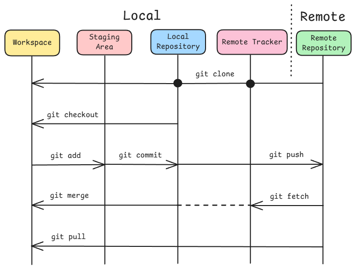
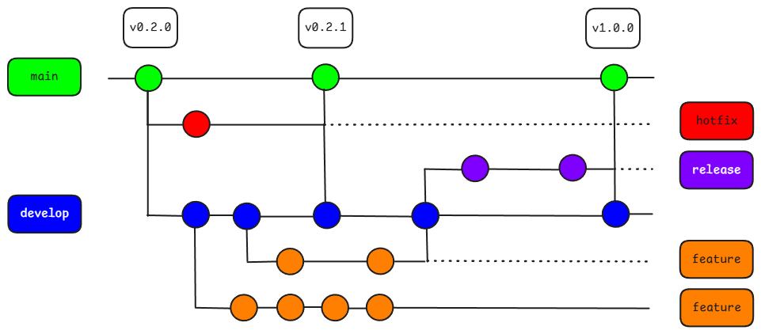

# Git Gud

> "Git Gud", an intentional mispelling of the phrase "get good", is an expression used to heckle inexperienced players or newbies in online video games.

---

## Table of Contents

-   [About](#about)
-   [Tech Stack](#tech-stack)
-   [Git Introduction](#git-introduction)
-   [Command Workflow](#command-workflow)
-   [Branching Strategy](#branching-strategy)
-   [Notes & Insights](#notes--insights)
-   [Changelog](#changelog)
-   [Contributing](#contributing)
-   [Acknowledgments](#acknowledgments)
-   [License](#license)

---

## About

This project was created to demonstrate Git version control using an example project with the Gitflow branching model. The documentation provides a guide built around this example project, including:

-   A quick introduction to version control and relevant Git concepts
-   Commonly used Git commands for a simple workflow
-   An overview of Git branching strategies and the Gitflow model
-   Supplementary notes and insights for further understanding

> [!IMPORTANT]
> While this guide is designed to be helpful, some details may be slightly inaccurate or simplified for intuitive understanding. Always verify knowledge, concepts and Git commands through official resources.

---

## Tech Stack

-   Version Control: **Git**
-   Remote Repository Hosting: **GitHub**
-   Integrated Development Environment: **Visual Studio Code**

---

## Git Introduction

### What is Git?

-   Git is a free and open-source distributed version control system (DVCS).
-   It is used to track changes in files and allows you to revert to previous versions when needed.
-   The history of files is stored in a place called a **repository**.
-   Git provides a set of commands to retrieve, modify, and manage files, including `commit`, `push`, `pull`, `merge`, and more.
-   Git can be initialised in any folder, turning it into a repository where Git commands can be used in the terminal.

### Why is Git Used

-   To efficiently retrieve, modify, and manage multiple versions of files or entire projects.
-   To enable effective collaboration with others through Git branching and merging.

### Git Concepts

-   **Repository**: Project folder tracked by Git, storing files and their history.
-   **Remote**: A repository hosted elsewhere, usually on the GitHub hosting platform.
-   **Origin**: Default name or reference for the main remote repository.
-   **Clone**: Copy of a remote repository on your local machine.
-   **Commit**: A saved version of your files at a specific point in time.
-   **Branch**: A separate line of development that starts from a specific commit, allowing changes without affecting the main branch.
-   **Push**: Send your local commits to a remote repository.
-   **Fetch**: Get updates from a remote repository for tracking changes in remote only and allowing comparison with the local repository.
-   **Merge**: Combine changes from a selected branch into the current branch. A merge conflict might occur.
-   **Pull**: Combination of fetch and merge.
-   **Pull Request (PR)**: A GitHub feature that sends a request to merge changes from a selected branch into another, usually the main branch.

---

## Command Workflow

> [!IMPORTANT]
> This section assumes a basic familiarity with using the terminal and navigating the GitHub interface.

### Creating a Repository

Remote → Local:

```
git clone <remote-url>
```

Local → Remote:

```
git init -b <main-branch>
git remote add <remote-repo> <remote-url>
```

### Viewing Repository Status and History

```
git remote -v
git status
git log --all --graph --oneline --decorate
```

### Creating Branches

```
git branch <new-branch>
git switch <new-branch>
```

Alternatively:

```
git checkout -b <new-branch>
```

### Making Changes

Stage changes locally:

```
git add .
```

Commit changes locally:

```
git commit -m "<message>"
```

Amend last commit:

```
git commit --amend -m "<new-message>"
```

Undo last commit but keep changes staged:

```
git reset --soft HEAD~1
```

Push commits to remote repository:

```
git push -u <remote-repo> <local-branch>
```

> [!TIP]
> The `-u` flag sets the upstream branch, linking the local branch to the remote branch. Afterwards, `git push` can be run without specifying the remote or branch.

### Commit Messages

-   It is beneficial to have a good commit messages. [Conventional Commits](https://www.conventionalcommits.org/en/v1.0.0/) can be used as a format.
-   Format: `<type>(<scope>): <short-message>`
-   Example:
    -   type: feat, fix, docs, style, refactor, test, chore
    -   scope: api, ui, auth, database
    -   short-message: present tense, specifically the imperative mood

### Pull Requests on GitHub

-   Developer proposes to merge their changes from one branch into another, usually the main or target branch.
-   Developers can propose changes, and others can review, discuss, and suggest improvements before the changes are merged.

### Updating Local Repository

Updating remote tracker and merging local branch:

```
git fetch <remote-repo>
git merge <remote-repo/remote-branch> <local-branch>
```

Alternatively:

```
git pull -u <remote-repo> <local-branch>
```

### Deleting Branches

```
git branch -d <local-branch>
git push <remote-repo> --delete <remote-branch>
```

> [!NOTE]
> Hash commits can be found in repository status or history.

### Undoing Commits History

Creates a new commit that undoes the commits after a specified commit:

```
git revert <hash-commit>
```

Delete commits history entirely after a specified commit:

```
git reset --hard <hash-commit>
git push --force <remote-repo> <local-branch>
```

> [!WARNING]
> Not recommended in collaborative work as it rewrites history.

### Tags and Versioning

-   Labelling specific commit with a tag, usually indicates the release version.
-   [Semantic Versioning](https://semver.org/) can be used as a format for the tag name.
-   Format: `MAJOR.MINOR.PATCH`
-   Example: `0.1.0`, `0.2.0`, `0.2.1`, `1.0.0`

```
git tag -a <version> -m "<message>"
```

### Command Workflow Diagram



-   `git clone` creates a local copy of a remote repository, sets up remote-tracking branches, and sets the main remote branch as the active branch in your workspace.
-   `git merge` allows merging with local branches or branches tracked from a remote repository into the current branch.

---

## Branching Strategy

### Overview

Branching strategies define how developers organise work in branches to manage features, releases, and fixes. Choosing the right strategy helps keep the project structured and collaboration smooth. Some common strategies include:

-   **Feature Branching**: Each new feature or bug fix is developed on its own separate, dedicated branch.
-   **Trunk-based Development**: All developers work on a single main branch (the "trunk"), with short-lived branches for specific tasks or features that are merged back quickly.
-   **Gitflow**: More complex, multi-branch approach with a `main` branch for production, a `develop` branch for ongoing development, `feature` branches, `release` branches and `hotfix` branches.

### Gitflow Model

-   Gitflow has numerous, longer-lived branches and larger commits.
-   Developers create a feature branch and delay merging it to the main trunk branch until the feature is complete.
-   These long-lived feature branches require more collaboration to merge.
-   Gitflow can be used for projects that have a scheduled release cycle.

### Gitflow Workflow



-   Gitflow branches:
    -   `main`: Always contains production-ready code.
    -   `develop`: Integration branch for features; reflects the next release state.
    -   `feature/<scope>`: Created from develop for new features, merged back into develop when done.
    -   `release/<scope>`: Created from develop when preparing a release; used for final fixes and versioning.
    -   `hotfix/<scope>`: Created from main to quickly fix production issues, then merged back into both main and develop.

### Why is Gitflow Used

-   Covers multiple branch types and workflows, showing how branching and merging interact.
-   Knowledge transfers easily to simpler models like feature branching or trunk-based development.

---

## Notes & Insights

-   In version control, "distributed" means decentralised system where each user can have full, independent copy of the entire project repository.
-   VS Code has a built-in graphical user interface (GUI) for version control, letting users stage, commit, push, pull, and manage branches without using the terminal.
-   Two other useful concepts for managing branches and controlling commit history are **rebase** and **squash commits**.
-   Gitflow is considered outdated for modern development because its long-lived branches and complexity can cause merge conflicts and slow CI/CD.
-   Trunk-based development uses a single main branch with frequent, short-lived integrations, enabling faster feedback, continuous deployment, and more agile workflows.

---

## Changelog

### [v0.1.0] - 2025-08-23

-   Initialise Git repository
-   Add MIT license ([LICENSE](LICENSE))
-   Add full documentation and guide ([README.md](README.md))
-   Add diagrams in assets ([docs](docs))

---

## Contributing

_Contribution and guidelines are not yet available (to be implemented in the future)_

---

## Acknowledgments

### Credits

-   Eternal gratitude to God, the Most Gracious, the Most Merciful.
-   Mad respect to [Linus Torvalds](https://github.com/torvalds) for creating Git in the first place.
-   Thanks to developers and maintainers of the [Git website](https://git-scm.com/) for making the version control system accessible for everyone.
-   Shoutouts to content creators for making Git and version control tutorials that are easy to follow through.

### References

-   https://git-scm.com/
-   https://www.youtube.com/watch?v=2ReR1YJrNOM&ab_channel=ProgrammingwithMosh
-   https://www.youtube.com/watch?v=e9lnsKot_SQ&ab_channel=ByteByteGo
-   https://www.youtube.com/watch?v=K6Q31YkorUE&t=1258s&ab_channel=ForrestKnight
-   https://www.youtube.com/@SuperSimpleDev
-   https://www.atlassian.com/git/tutorials/comparing-workflows/gitflow-workflow
-   https://www.conventionalcommits.org/en/v1.0.0/
-   https://semver.org/
-   https://docs.github.com/en/get-started/writing-on-github/getting-started-with-writing-and-formatting-on-github/basic-writing-and-formatting-syntax
-   https://www.youtube.com/watch?v=xvFZjo5PgG0&ab_channel=Duran

---

## License

This project is licensed under the [MIT License](LICENSE).
